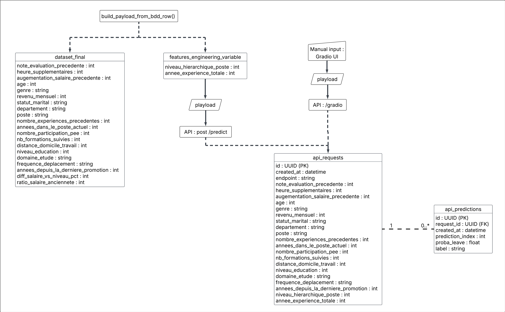
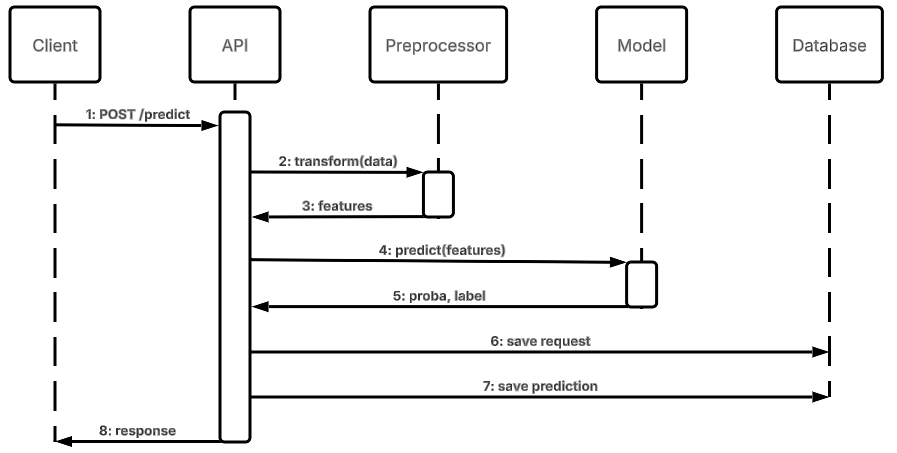

<a id="readme-top"></a>
<br />
<div align="center">

<h3 align="center">API Modèle de décision</h3>

  <p align="center">
    Ce projet consiste à déployer le modèle de classification, créé lors du projet 4, afin de déterminer si un employé va quitter ou non l'entreprise.
  </p>
</div>

<!-- TABLE OF CONTENTS -->
<details>
  <summary>Sommaire</summary>
  <ol>
    <li>
      <a href="#a-propos-du-projet">À propos du projet</a>
    </li>
    <li>
      <a href="#vue-densemble">Vue d'ensemble</a>
    </li>
    <li>
      <a href="#modele-expose">Modèle exposé</a>
    </li>
    <li>
      <a href="#architecture">Architecture</a>
      <ul>
        <li><a href="#schema-uml-interactions-api--bdd">Schéma UML (interactions API / BDD)</a></li>
      </ul>
    </li>
    <li>
      <a href="#demarrage">Démarrage</a>
      <ul>
        <li><a href="#prerequis">Prérequis</a></li>
        <li><a href="#installation">Installation</a></li>
      </ul>
    </li>
    <li><a href="#contrat-api">Contrat API</a></li>
  </ol>
</details>

## À propos du projet

Scénario : après avoir créé un modèle à la demande du département des ressources humaines afin d'établir les causes d'attrition du personnel au sein de l'entreprise et de prédire le risque de départ d'un employé, l'objectif est désormais de déployer ce modèle de machine learning en production.

## Vue d'ensemble

L'application expose :
- une API FastAPI pour la prédiction,
- une UI Gradio montée dans FastAPI,
- un mode d'exécution piloté par `APP_MODE` pour activer ou non les interactions avec la base de données.

Points d'entrée principaux :
- `GET /health` : statut applicatif,
- `POST /predict` : prédiction sur un batch d'enregistrements,
- `/gradio` : interface utilisateur Gradio,
- `/docs` : documentation interactive Swagger

## Modèle exposé

Le modèle déployé est un **Balanced Random Forest** optimisé avec un score pondéré métier :

\[
Score\_pondéré = 0.30 \times Recall + 0.50 \times F1 + 0.20 \times Accuracy
\]

### Métriques de performance

| Métrique | Valeur |
|---|---|
| Recall | 0.64 |
| Precision | 0.42 |
| Accuracy | 0.64 |
| Score pondéré | 0.61 |
| AUC-ROC | 0.76 |

### Origine des données d'entraînement

Le modèle a été entraîné sur des données provenant du département des ressources humaines de l'entreprise, avec environ 1 400 échantillons au total. Chaque échantillon comporte des informations sur les caractéristiques de l'employé (features demandées dans les enregistrements de l'API), ainsi qu'une variable cible indiquant si celui-ci est encore présent ou non dans l'entreprise.

## Architecture

### Schéma UML (interactions API / BDD)



### Diagramme de séquence (flux de prédiction)



<p align="right">(<a href="#readme-top">back to top</a>)</p>

## Démarrage

Ce modèle peut être utilisé de deux manières :
- en déploiement local,
- via Hugging Face.

Le comportement est piloté par la variable `APP_MODE`.

- `APP_MODE=local`
  - active la base de données,
  - crée les tables `api_requests` et `api_predictions` au démarrage,
  - journalise les requêtes et prédictions.

- `APP_MODE=huggingface` (ou `demo`)
  - désactive toute interaction avec une base de données,
  - API et UI restent disponibles.

### Prérequis

- Python 3.12
- `uv`
- PostgreSQL accessible avec les identifiants configurés

### Installation

#### Déploiement local

En déploiement local, crée un fichier `.env` (à la racine du projet ou dans `confs`) pour connecter l'API à PostgreSQL.

1. Clone le dépôt
   ```sh
   git clone https://github.com/leskimou/openclassrooms_projet5.git
   ```

2. Installe les dépendances
   ```sh
   uv sync
   ```

3. Configure ton fichier `.env` (adapte les variables selon ta BDD)
   ```.env
   DB_HOST=localhost
   DB_NAME=postgres
   DB_USER=postgres
   DB_PASSWORD=votremotdepasse
   DB_PORT=5432
   APP_MODE=local
   ```

4. Lance l'application
   ```sh
   uv run python -m uvicorn main:app --reload --host 127.0.0.1 --port 7860
   ```

5. Teste l'état de santé
   ```sh
   Invoke-RestMethod http://127.0.0.1:7860/health
   ```

### Déploiement Hugging Face (Docker Space)

Tu peux tester l'API sur le Space Hugging Face : [huggingface-space]

- Le conteneur démarre avec `uvicorn main:app` sur le port `7860`.
- `APP_MODE=huggingface` dans les variables du Space.
- Lorsque `APP_MODE` n'est pas `local`, aucune opération avec la base de données n'est exécutée.

#### Accès à la documentation API via Hugging Face

- Swagger UI : [swagger-docs]
- ReDoc : [redoc-docs]
- OpenAPI JSON : [openapi-json]

<p align="right">(<a href="#readme-top">back to top</a>)</p>

## Contrat API

### `GET /health`

Réponse attendue :

```json
{
  "status": "ok"
}
```

### `POST /predict`

Entrée :
- payload JSON avec `records` (liste non vide d'objets),
- chaque record doit contenir exactement les features attendues par `artifacts/input_schema.json`.

Exemple d'entrée :

```json
{
  "records": [
    {
      "note_evaluation_precedente": 3.8,
      "heure_supplementaires": "Oui",
      "augementation_salaire_precedente": 7,
      "age": 36,
      "genre": "M",
      "revenu_mensuel": 6200,
      "statut_marital": "Marié(e)",
      "departement": "Commercial",
      "poste": "Cadre Commercial",
      "nombre_experiences_precedentes": 3,
      "annees_dans_le_poste_actuel": 4,
      "nombre_participation_pee": 2,
      "nb_formations_suivies": 3,
      "distance_domicile_travail": 12,
      "niveau_education": 4,
      "domaine_etude": "Marketing",
      "frequence_deplacement": "Occasionnel",
      "annees_depuis_la_derniere_promotion": 1,
      "niveau_hierarchique_poste": 3,
      "annee_experience_totale": 11
    }
  ]
}
```

Sortie :
- `proba_leave` : liste de probabilités de départ,
- `label` : liste de labels binaires (seuil `0.5`).

Exemple de sortie :

```json
{
  "proba_leave": [0.41080546448420147],
  "label": [0]
}
```

Codes de réponse :
- 200 : succès
- 422 : payload invalide (feature manquante, type invalide, modalité inconnue, etc.)

<!-- MARKDOWN LINKS & IMAGES -->
<!-- https://www.markdownguide.org/basic-syntax/#reference-style-links -->
[huggingface-space]: https://huggingface.co/spaces/leskimou/openclassrooms_projet5
[swagger-docs]: https://leskimou-openclassrooms-projet5.hf.space/docs
[redoc-docs]: https://leskimou-openclassrooms-projet5.hf.space/redoc
[openapi-json]: https://leskimou-openclassrooms-projet5.hf.space/openapi.json
